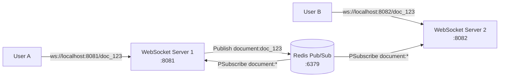
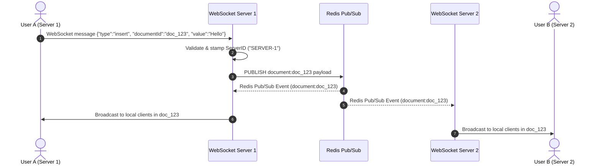

# CollabFlow Architecture — Week 2 Distributed WebSocket Layer

This document describes the distributed architecture for CollabFlow's horizontally scalable real-time collaboration engine using Redis Pub/Sub.

---

## Distributed System Architecture

---

## Sequence Flow: Distributed Edit Broadcast

---

## Core System Components

### 1. Configuration & Environments (`internal/config`)
- Loads `PORT`, `REDIS_ADDR`, and `SERVER_ID` dynamically from environment variables.
- Defaults to local development parameters when unconfigured.

### 2. Messaging & Event Protocol (`internal/messaging`)
- Defines standard payload structure (`Event`) supporting edit type (`insert`, `delete`), `documentId`, `userId`, `position`, `content`, `value`, `serverId`, and `payload` for future CRDT integrations.

### 3. Redis Publisher & Subscriber (`internal/redis`)
- **Publisher**: Serializes edits and publishes to Redis channel `document:<documentID>`.
- **Subscriber**: Subscribes to pattern `document:*`. Listens asynchronously for events across all active document channels and forwards them to the WebSocket engine.

### 4. Stateless WebSocket Hub (`internal/websocket`)
- Does **not** maintain document state or global user presence in server memory.
- Manages local client connections partitioned into document-based rooms (`rooms map[string]map[*Client]bool`).
- Forwards local user actions to Redis Pub/Sub and dispatches incoming Redis events to connected local clients in the specified room.

### 5. Executables (`cmd/`)
- **`cmd/websocket-server/main.go`**: Distributed WebSocket node server listening for client connections.
- **`cmd/redis-worker/main.go`**: Background worker process monitoring and logging Redis Pub/Sub document stream activity.
