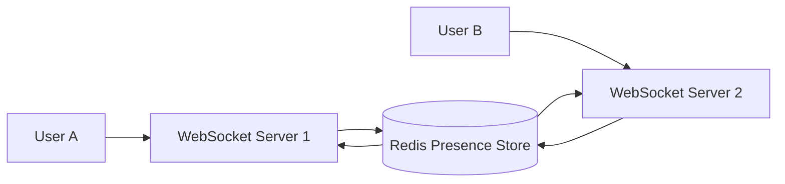
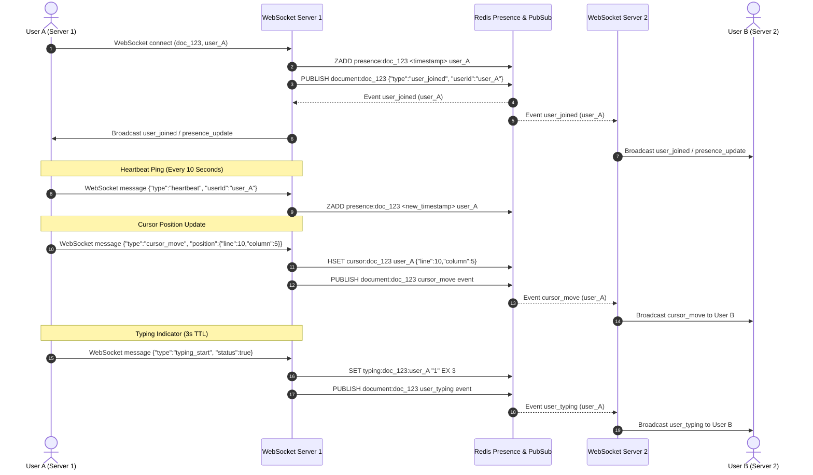

# CollabFlow Architecture — Week 3 Real-Time Presence System

This document describes the architecture for CollabFlow's production-grade, distributed real-time presence system using Redis.

---

## Distributed System Architecture

---

## Sequence Flow: Real-Time Presence & Heartbeat Monitoring

---

## Ephemeral Storage Engine & Redis Data Model

Presence data (online status, last-seen timestamps, cursor positions, typing state) is high-frequency, temporary data and is **never stored in PostgreSQL**. Redis serves as the sole source of truth.

### 1. Online Users (`presence:{document_id}`)
- **Data Structure**: Sorted Set (`ZSET`)
- **Member**: `user_id`
- **Score**: Last seen Unix timestamp (in seconds)
- **Usage**: Enables fast timestamp ranges (`ZRANGEBYSCORE`) to retrieve active users and evict offline users.

### 2. Cursor Position Tracking (`cursor:{document_id}`)
- **Data Structure**: Hash (`HASH`)
- **Field**: `user_id`
- **Value**: JSON encoded position string (e.g. `{"line":10,"column":5}` or `{"x":200,"y":300}`)
- **Usage**: Persists cursor positions per room without database overhead.

### 3. Typing Indicators (`typing:{document_id}:{user_id}`)
- **Data Structure**: String key with 3-second TTL (`SET key "1" EX 3`)
- **Usage**: Automatically expires when user stops typing after 3 seconds.

---

## Background Cleanup Worker

- **Execution Interval**: Every 30 seconds.
- **Inactivity Threshold**: 30 seconds (`current_time - last_seen > 30s`).
- **Operation**:
  1. Scans active document presence sets (`presence:*`).
  2. Executes `ZREMRANGEBYSCORE presence:{doc_id} -inf (cutoff)`.
  3. Deletes cursor entries (`HDEL cursor:{doc_id} {user_id}`).
  4. Publishes `user_left` events across Redis Pub/Sub so all WebSocket servers update connected room clients.

---

## Core Component Layout

### 1. Presence Package (`internal/presence`)
- **`manager.go`**: High-level presence registration, fetch, and event dispatch.
- **`heartbeat.go`**: Processes 10s ping heartbeats and refreshes ZSET timestamps.
- **`cleanup.go`**: Background worker loop running every 30s for offline user eviction.

### 2. Cursor Package (`internal/cursor`)
- **`tracker.go`**: Stores and updates real-time cursor coordinates in Redis Hash.

### 3. Typing Package (`internal/typing`)
- **`indicator.go`**: Manages typing key creation with 3-second TTL.

### 4. Redis Layer (`internal/redis`)
- **`presence.go`**: Low-level Redis commands (`ZADD`, `ZRANGEBYSCORE`, `HSET`, `HGETALL`, `SET EX`, `ZREMRANGEBYSCORE`).

### 5. WebSocket Hub Integration (`internal/websocket`)
- Decoupled room management and event dispatch forwarding presence, cursor, and typing events across nodes via Redis Pub/Sub.
