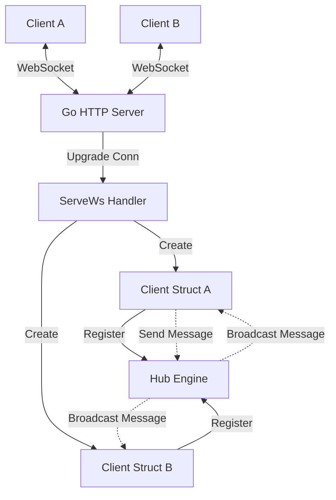

# CollabFlow Architecture — Week 1 Day 1

This document outlines the software architecture for the foundational real-time collaboration engine implemented in Week 1.

## System Components



### 1. Main Entrypoint (`cmd/websocket-server/main.go`)
- Sets up environment configuration (e.g. `PORT`).
- Instantiates and starts the main synchronization engine (`Hub`).
- Registers the `/ws` HTTP endpoint.

### 2. Hub (`internal/websocket/hub.go`)
- Maintains thread-safe registration of connected clients using standard synchronization primitives (`sync.RWMutex`).
- Coordinates message distribution. When a client publishes a message, it is received on the `broadcast` channel and dispatched to the write buffers of all registered clients.
- Coordinates graceful connection termination and removal of inactive clients.

### 3. Client (`internal/websocket/client.go`)
- Represents a single connection session.
- Runs two continuous pumps per connection:
  - **`ReadPump`**: Listens for incoming WebSocket frames from the user, parses JSON into `models.Message` schema, and forwards them to the hub's `broadcast` channel.
  - **`WritePump`**: Consumes messages from the client's internal buffered channel and writes them down the socket to the client. Includes periodic heartbeat `Ping` frames to keep the connection alive and detect zombie clients.

### 4. Message Schema (`internal/models/message.go`)
- Employs a payload structure optimized for future conflict-free replicated data type (CRDT) operations:
  ```json
  {
    "type": "insert",
    "userId": "userA",
    "documentId": "doc123",
    "content": "Hello",
    "payload": null
  }
  ```
