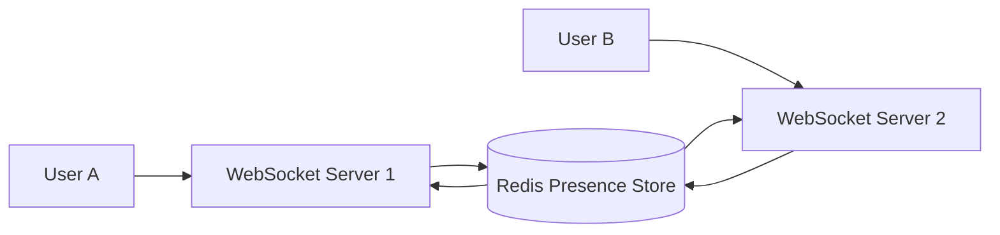

# CollabFlow — Scalable Real-Time Distributed Collaboration Backend

CollabFlow is a production-grade, horizontally scalable real-time collaborative editing backend built with **Go**, **WebSockets**, and **Redis**.

---

## Architecture Overview



---

## Features (Week 3 Real-Time Presence System)

- **Online User Tracking**: Real-time tracking of active users per document using Redis Sorted Sets (`presence:{document_id}`).
- **Connection Heartbeats**: 10-second client ping/pong heartbeats updating active presence scores in Redis.
- **Background Cleanup Worker**: 30-second interval worker evicting inactive users (>30 seconds) and broadcasting `user_left` events across servers.
- **Cursor Position Sharing**: Real-time cursor coordinates shared across clients using Redis Hashes (`cursor:{document_id}`).
- **Typing Indicators**: Temporary typing status with automatic 3-second expiration using Redis TTL keys (`typing:{document_id}:{user_id}`).
- **Distributed State Synchronization**: State synced across stateless WebSocket server nodes via Redis Pub/Sub channels (`document:<document_id>`).

---

## Redis Data Structures

| Feature | Key Format | Data Structure | Description |
| :--- | :--- | :--- | :--- |
| **Online Users** | `presence:{document_id}` | Sorted Set (`ZSET`) | Member = `userID`, Score = last heartbeat Unix timestamp |
| **Cursor Positions** | `cursor:{document_id}` | Hash (`HASH`) | Field = `userID`, Value = JSON position (`line`/`column` or `x`/`y`) |
| **Typing State** | `typing:{document_id}:{user_id}` | Key with 3s TTL | Flag key set with 3-second expiration |
| **Pub/Sub Channels** | `document:{document_id}` | Pub/Sub Channel | Broadcast channel for cross-server event distribution |

---

## Prerequisites

- **Go 1.26+**
- **Docker & Docker Compose**
- **Redis 7+** (or run via Docker Compose)
- **k6** (for load testing)

---

## Quick Start (Docker Development Environment)

Start the distributed environment containing **WebSocket Server 1** (port 8081), **WebSocket Server 2** (port 8082), and **Redis** (port 6379):

```bash
docker compose up --build
```

---

## Testing Real-Time Distributed Collaboration

### Manual Testing with `wscat`

1. Open two terminal windows.

2. **Terminal 1 (User A on Server 1)**:
   ```bash
   npx wscat -c "ws://localhost:8081/doc_123?userId=user_A"
   ```

3. **Terminal 2 (User B on Server 2)**:
   ```bash
   npx wscat -c "ws://localhost:8082/doc_123?userId=user_B"
   ```

4. **Heartbeat Event**:
   ```json
   {"type":"heartbeat","userId":"user_A"}
   ```

5. **Cursor Position Update**:
   ```json
   {"type":"cursor_move","userId":"user_A","position":{"line":10,"column":5}}
   ```

6. **Typing Indicator**:
   ```json
   {"type":"typing_start","userId":"user_A"}
   ```

---

## Automated Unit & Integration Tests

Run unit and integration tests (including presence registration, heartbeat updates, offline cleanup, and multi-server Redis broadcast):

```bash
go test -v ./...
```

---

## Load Testing with k6

Run the load test simulating **1000 concurrent WebSocket connections**:

```bash
k6 run scripts/load-test.js
```

Or target a specific server:

```bash
WS_SERVER_URL=ws://localhost:8081 k6 run scripts/load-test.js
```

Measures:
- Active connections & message throughput (Messages/sec)
- WebSocket connection latency
- Redis memory usage and command response times

---

## Project Structure

```
collabflow
├── cmd
│   ├── websocket-server
│   │   └── main.go
│   └── redis-worker
│       └── main.go
├── internal
│   ├── config
│   │   └── config.go
│   ├── cursor
│   │   └── tracker.go
│   ├── messaging
│   │   └── event.go
│   ├── presence
│   │   ├── cleanup.go
│   │   ├── heartbeat.go
│   │   ├── manager.go
│   │   └── presence_test.go
│   ├── redis
│   │   ├── client.go
│   │   ├── presence.go
│   │   ├── publisher.go
│   │   ├── redis_test.go
│   │   └── subscriber.go
│   ├── typing
│   │   └── indicator.go
│   └── websocket
│       ├── client.go
│       ├── hub.go
│       ├── server.go
│       └── websocket_test.go
├── scripts
│   └── load-test.js
├── docker-compose.yml
├── Dockerfile
├── ARCHITECTURE.md
└── README.md
```
