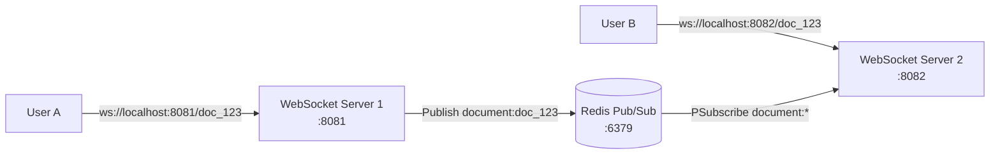

# CollabFlow — Scalable Real-Time Distributed Collaboration Backend

CollabFlow is a production-grade, horizontally scalable real-time collaborative editing backend built with **Go**, **WebSockets**, and **Redis Pub/Sub**.

---

## Architecture Overview



---

## Features (Week 2 Distributed Layer)

- **Horizontal Scalability**: Run multiple WebSocket server instances simultaneously behind a load balancer.
- **Redis Pub/Sub Layer**: Cross-server event routing using channel patterns (`document:<document_id>`).
- **Stateless WebSocket Nodes**: Document content and global state are decoupled from server memory.
- **Document Room Routing**: Automatic client room isolation by document ID.
- **Structured Observability**: Multi-server logging with server tags (`[SERVER-1]`, `[SERVER-2]`).

---

## Prerequisites

- **Go 1.26+**
- **Docker & Docker Compose**
- **Redis 7+** (or run via Docker Compose)

---

## Quick Start (Docker Development Environment)

Start the distributed environment containing **WebSocket Server 1** (port 8081), **WebSocket Server 2** (port 8082), and **Redis** (port 6379):

```bash
docker compose up --build
```

---

## Testing Real-Time Distributed Collaboration

### Manual Testing with `wscat`

1. Open two terminal windows.

2. **Terminal 1 (User A on Server 1)**:
   ```bash
   npx wscat -c "ws://localhost:8081/doc_123?userId=user_A"
   ```

3. **Terminal 2 (User B on Server 2)**:
   ```bash
   npx wscat -c "ws://localhost:8082/doc_123?userId=user_B"
   ```

4. **In Terminal 1 (User A)**, send an edit:
   ```json
   {"type":"insert","documentId":"doc_123","userId":"user_A","position":5,"content":"Hello from Server 1"}
   ```

5. **In Terminal 2 (User B)**, observe the real-time update delivered across Redis Pub/Sub:
   ```json
   {"type":"insert","documentId":"doc_123","userId":"user_A","position":5,"content":"Hello from Server 1","serverId":"SERVER-1"}
   ```

---

## Automated Test Suite

Run unit and integration tests (including multi-server Redis broadcast tests):

```bash
go test -v ./...
```

---

## Project Structure

```
collabflow
├── cmd
│   ├── websocket-server
│   │   └── main.go
│   └── redis-worker
│       └── main.go
├── internal
│   ├── config
│   │   └── config.go
│   ├── messaging
│   │   └── event.go
│   ├── redis
│   │   ├── client.go
│   │   ├── publisher.go
│   │   ├── subscriber.go
│   │   └── redis_test.go
│   └── websocket
│       ├── client.go
│       ├── hub.go
│       ├── server.go
│       └── websocket_test.go
├── docker-compose.yml
├── Dockerfile
├── ARCHITECTURE.md
└── README.md
```
